# My-TTGO-Watchfaces

Here you can find some finish watchface packages for [My-TTGO-Watch](https://github.com/sharandac/My-TTGO-Watch):
This is a fork of original Sharandac TTGO TWatch Clock Faces

[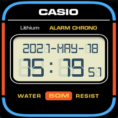](casio/watchface.tar.gz)

[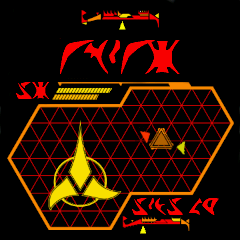](klingon/watchface.tar.gz)
[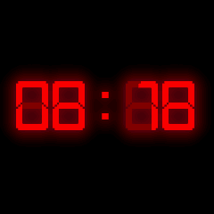](led/watchface.tar.gz)

# Here are some new faces

You can find more watch faces by looking on GitHub for [topic my-ttgo-watch-face](https://github.com/topics/my-ttgo-watch-face) or an overview of all [watchfaces](https://sharandac.github.io/My-TTGO-Watchfaces/).
Feel free to clone them and create yours!

[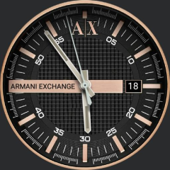](armaniex/watchface.tar.gz)
[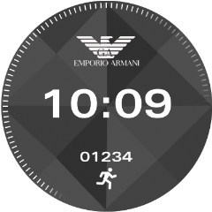](armanicon/watchface.tar.gz)
[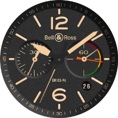](bellross/watchface.tar.gz)
[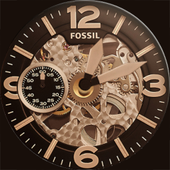](fossil/watchface.tar.gz)
[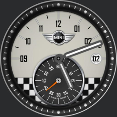](mini-cooper/watchface.tar.gz)
[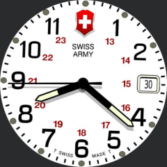](swissarmy/watchface.tar.gz)
[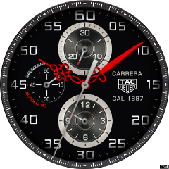](tagheuer/watchface.tar.gz)
[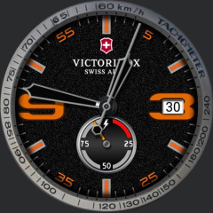](victorinox/watchface.tar.gz)
[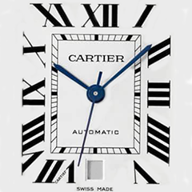](cartier/watchface.tar.gz)
